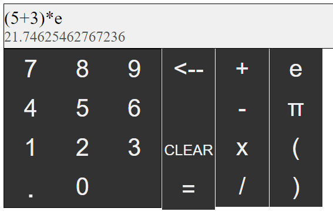
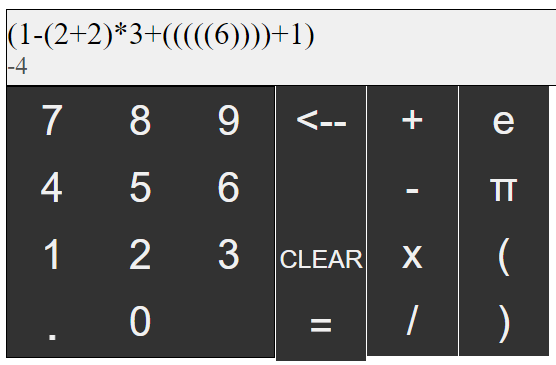
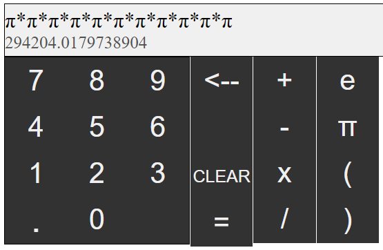

# Calculator
This is an old project I did in high school. I just decided to learn programming. I already did something in html so I naturally tried javascript. This is my first attempt at a little more serious program. The code is aweful since I didn't know much about programming. But it works!

## Install

1. Just open the [kalkulacka.html](kalkulacka.html) file

## Credits

- [Tomáš Žilínek](https://www.linkedin.com/in/tomaszilinek)

